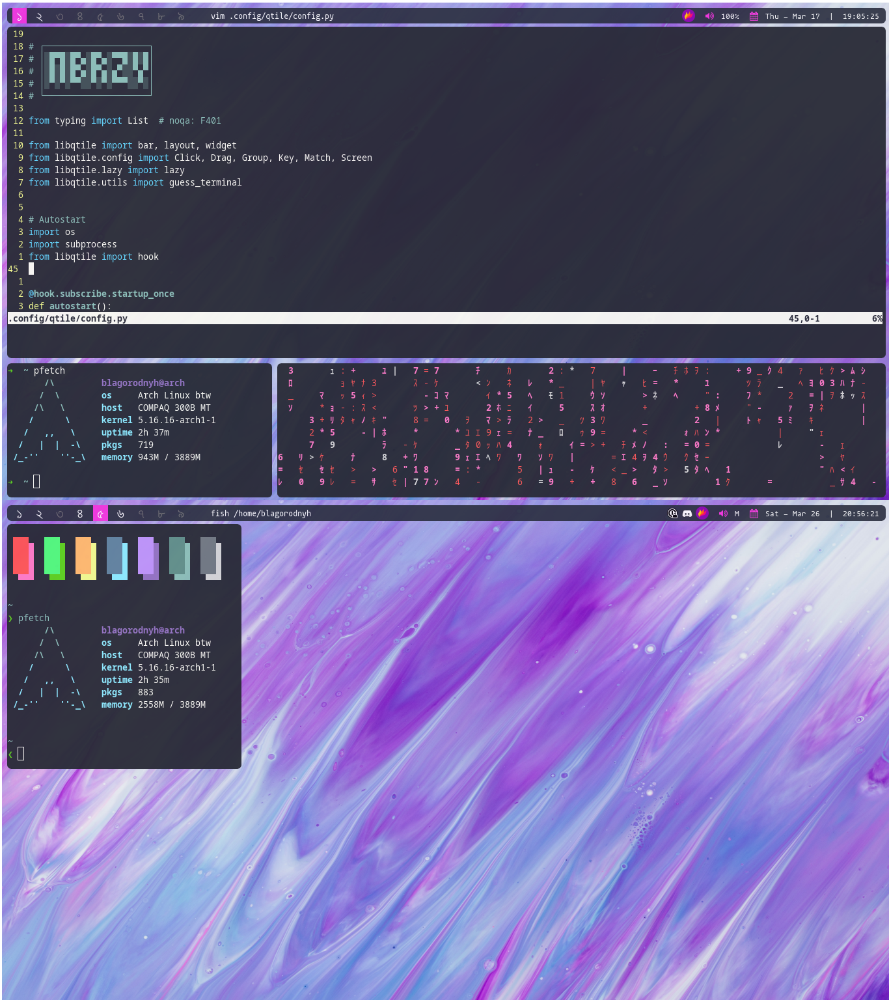

# dotfiles

## Preview

Hello, this is my dotfiles repo for my first Qtile rice.
To apply it, you just need to link or copy the files to the right folders:
  - Everything within .config/ goes to ~/.config/
  - The 'wallpapers' folder goes to your home folder.
